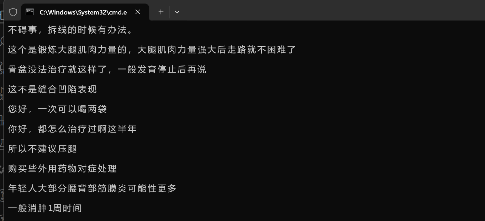
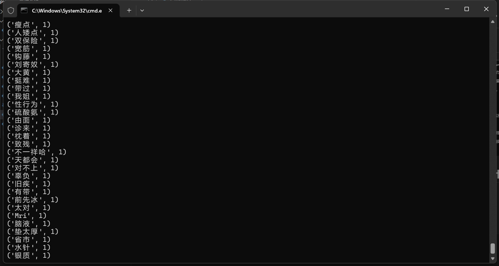
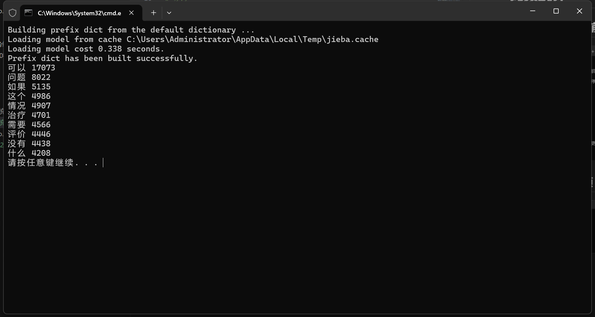
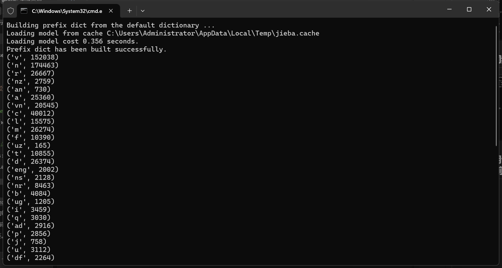
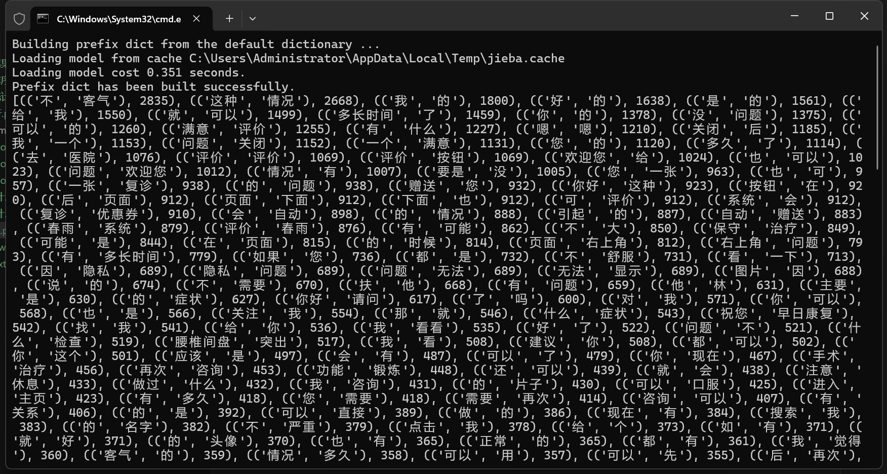
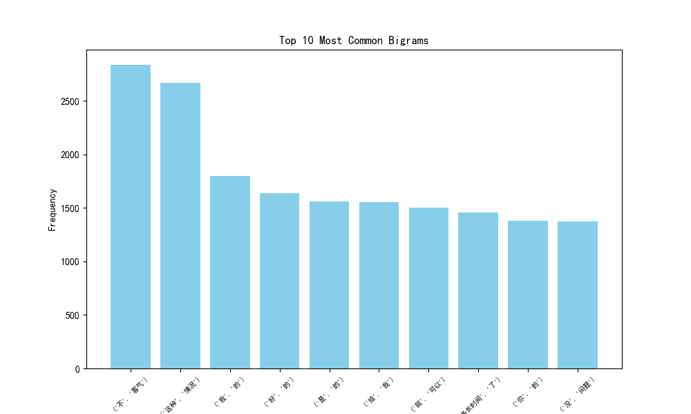
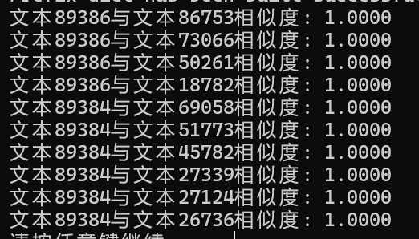

# 词频统计

## 1.读取文档，打印前10行

## 2.分词并统计词频
一部分结果

## 3.词频最高的10个词

## 4 5.用词云可视化，引入停用词表前后对比

* 未加入停用词表

* 加入停用词表

## 6.词性统计

对名词进行词云可视化

## 7.统计bi-gram频率并可视化高频词

## 8. 特征词和相似度计算

根据词频排序，选择前2500个词作为特征词

选用词袋向量的方法对每一行文本进行向量表示

经过一系列优化后，通过近似最近邻搜索方法找到相似度最高10条文本
结果如下

# 代码

## 词频统计

## 1.

    import jieba
    import wordcloud
    # 读取和分词
    with open(r'week2\词频\week2.txt', 'r', encoding='utf-8') as f:
        file = f.read()
        # file_lis = f.readlines()
        # for i in range(10):
        #     print(file_lis[i])

    # 分词
    words = jieba.lcut(file)

    # 统计词频
    counts = {}

    for word in words:
        if len(word) == 1:
            continue
        else:
            counts[word] = counts.get(word, 0) + 1

    # print(*counts.items(),sep='\n')

    # 转化为列表进行后续处理
    counts_lis = counts.items()
    counts_lis = sorted(counts_lis, key=lambda x: x[1], reverse=True)

    # 输出前10个高频词
    def show_top10():
        for i in range(10):
            word, count = counts_lis[i][0], counts_lis[i][1]
            print(f'{word} {count}')

    # 处理为词云可以处理的格式
    words_show_root = [word for word in words if len(word) > 1]
    words_show = ' '.join(words_show_root)

    def wordcloud_show():
        # 生成词云
        wc = wordcloud.WordCloud(font_path='msyh.ttc', width=800, height=600, background_color='white')
        wc.generate(words_show)
        wc.to_file(r'week2\词频\img\wordcloud.png')

    def wordcloud_show_stop():
        # 引入停用词表
        with open(r'week2\词频\cn_stopwords.txt', 'r', encoding='utf-8') as f:
            stopwords = f.read().splitlines()

        words_show_stop = ' '.join([word for word in words if word not in stopwords])

        # 再次生成词云
        wc = wordcloud.WordCloud(font_path='msyh.ttc', width=800, height=600, background_color='white')
        wc.generate(words_show_stop)
        wc.to_file(r'week2\词频\img\wordcloud_stop.png')

    # 词性分析
    def posseg_show():
        import jieba.posseg as pseg
        words = pseg.cut(''.join(words_show_root))
        posseg_count = {}

        # # 统计词性频率
        # for _, flag in words:
        #     posseg_count[flag] = posseg_count.get(flag, 0) + 1
        # print(*posseg_count.items(),sep='\n')

        # 对名词词性进行词云可视化
        words_show_posseg = ' '.join([word for word, flag in words if flag[0] == 'n'])
        wc = wordcloud.WordCloud(font_path='msyh.ttc', width=800, height=600, background_color='white')
        wc.generate(words_show_posseg)
        wc.to_file(r'week2\词频\img\wordcloud_n.png')

    # 利用词频筛选特征词

    def feature_words():
        # word_show_root是初始文本，处理停用词
        with open(r'week2\词频\cn_stopwords.txt', 'r', encoding='utf-8') as f:
            stopwords = f.read().splitlines()
        words_show_stop = [word for word in words_show_root if word not in stopwords]

        # 进行词频统计
        counts = {}
        for word in words_show_stop:
            counts[word] = counts.get(word, 0) + 1

        # 转化为列表进行后续处理
        counts_lis = counts.items()
        counts_lis = sorted(counts_lis, key=lambda x: x[1], reverse=True)
        # print(counts_lis)

        # 保留前2500个词作为特征词
        feature_words = [item[0] for item in counts_lis[:2500]]
        # print(feature_words)

        from sklearn.neighbors import NearestNeighbors  # 替代LSHForest
        from sklearn.feature_extraction.text import CountVectorizer
        import jieba

        feature_words = [word.lower() for word in feature_words]  # 统一转小写
        feature_words = list(set(feature_words))

        vectorizer = CountVectorizer(
            vocabulary=feature_words,
            lowercase=True
        )

        with open(r'week2\词频\week2.txt', 'r', encoding='utf-8') as f:
            corpus = [line.strip() for line in f.readlines()]

        corpus = [' '.join(jieba.lcut(line)) for line in corpus]

        bow_matrix = vectorizer.fit_transform(corpus)
        
        import numpy as np

        # 只考虑非零向量
        row_norms = np.sqrt((bow_matrix.power(2)).sum(axis=1))
        nonzero_mask = np.array(row_norms).flatten() > 0

        bow_matrix = bow_matrix[nonzero_mask]

        # 近似最近邻搜索
        nbrs = NearestNeighbors(n_neighbors=10, algorithm='auto', metric='cosine')
        nbrs.fit(bow_matrix)
        distances, indices = nbrs.kneighbors(bow_matrix)

        # 提取top10
        top_pairs = []
        for i, neighbors in enumerate(indices):
            for j, idx in enumerate(neighbors):
                if i != idx:
                    top_pairs.append( (1 - distances[i][j], i, idx) )
        top_pairs = sorted(list(set(top_pairs)), reverse=True)[:10]

        # 打印结果
        for sim, i, j in top_pairs:
            print(f"文本{i}与文本{j}相似度: {sim:.4f}")
    if __name__ == '__main__':
        # show_top10()
        # wordcloud_show_stop()
        # wordcloud_show()
        # posseg_show()
        feature_words()

## 2.

    import nltk
    import jieba
    import re 
    import matplotlib.pyplot as plt

    with open(r'week2\词频\week2.txt', 'r', encoding='utf-8') as f:
        file = f.readlines()

    bi_gram = []
    # 按行进行分词和二元组提取
    for txt in file:
        txt = re.sub(r'[^\w\s]', '', txt[:-1])
        txt = re.sub(r' ', '', txt)
        tokens = jieba.lcut(txt)
        bi_gram.extend(list(nltk.bigrams(tokens)))

    # 统计二元组出现的频率
    bi_gram_freq = nltk.FreqDist(bi_gram)
    print(bi_gram_freq.most_common())

    top_10 = bi_gram_freq.most_common(10)

    # 分解二元组和频率
    bigrams, frequencies = zip(*top_10)
    x_list = [i for i in range(10)]
    # 绘制条形图
    plt.figure(figsize=(10, 6))
    plt.bar(x_list, frequencies, color='skyblue')
    plt.xlabel('Bigrams')
    plt.ylabel('Frequency')
    plt.title('Top 10 Most Common Bigrams')
    plt.xticks(x_list,bigrams, rotation=45,fontsize=7)
    plt.savefig(r'week2\词频\img\bi_gram.png')
    plt.show()