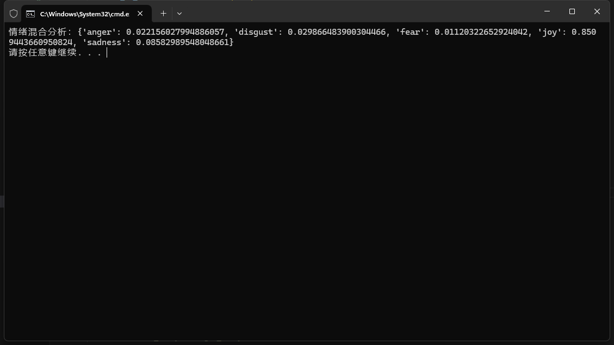
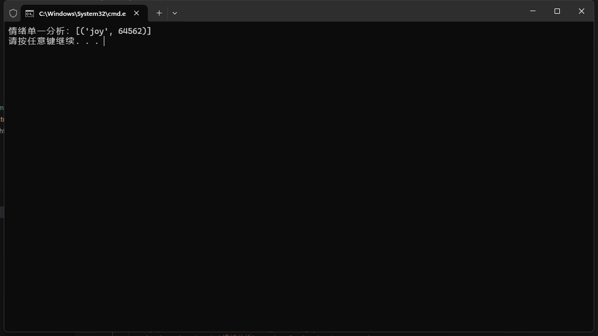
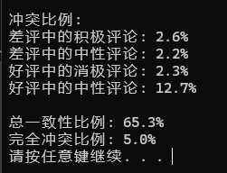
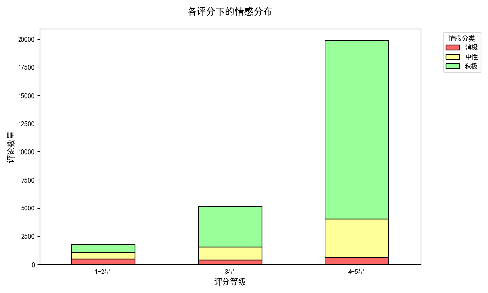
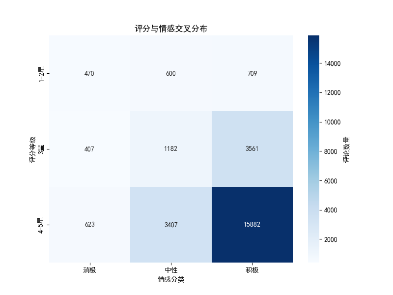
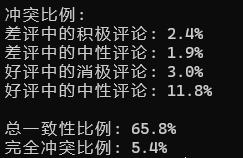
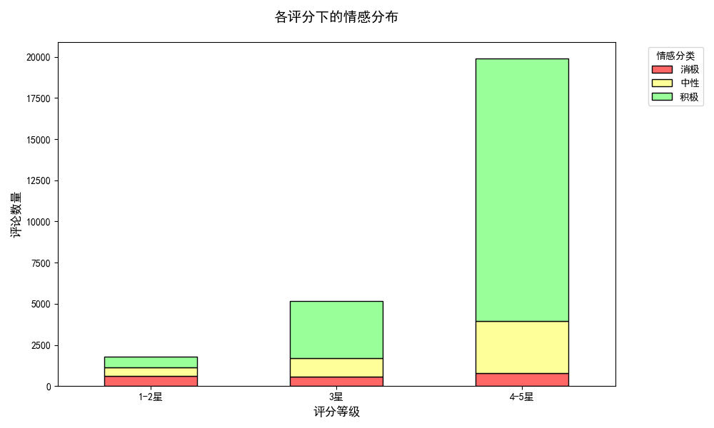
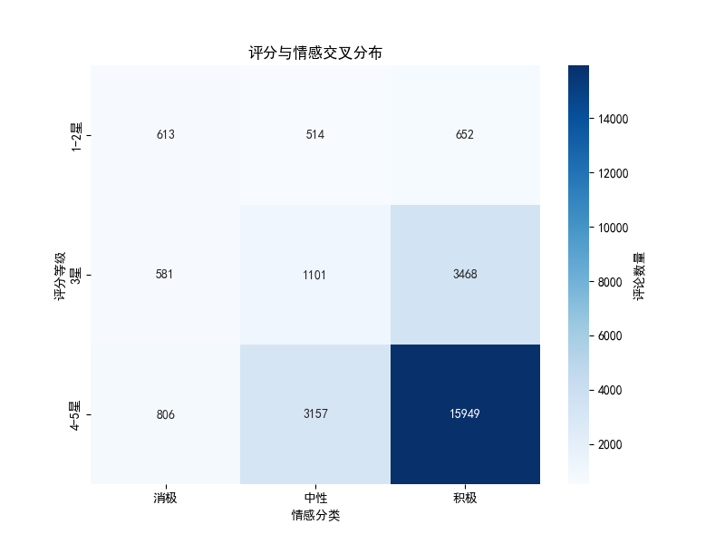

# 情绪分析

## 1. 情绪分析函数实现

### 混合情绪分析

### 单一情绪分析

## 2. 时间模式分析函数实现

采用可互动窗口绘制折线图，这里是完整的截图

- **518986 D joy** 

- **518986 ME joy**

- **520004 h anger**

完整视图

局部

## 3. 情绪分析和评分对比

## 4. 大模型扩充情绪词典

